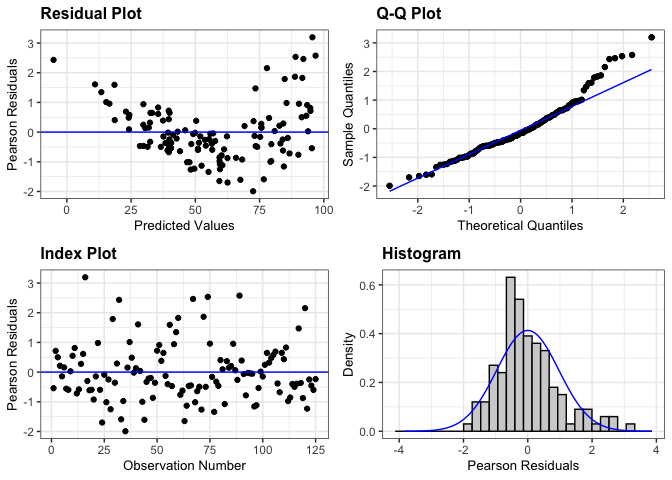
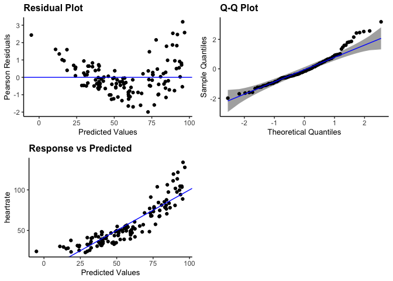
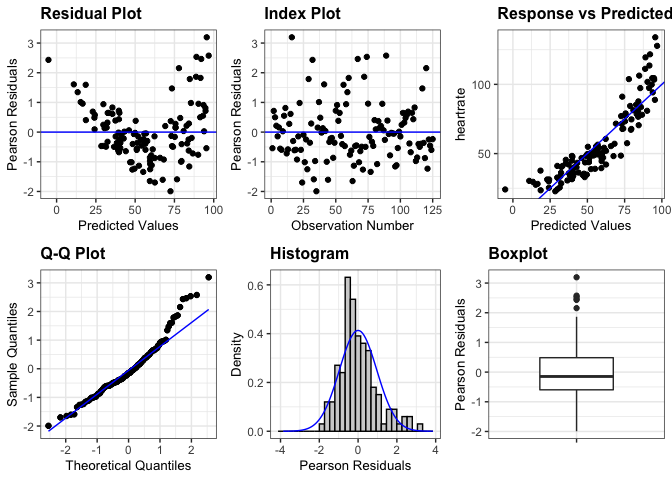
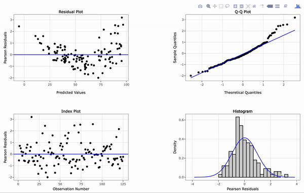
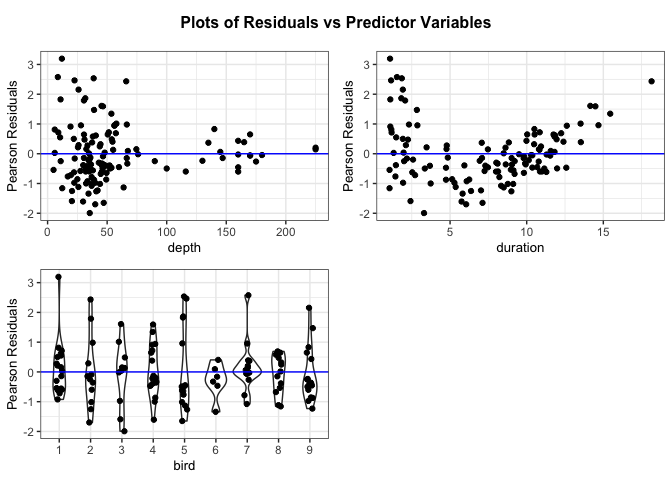
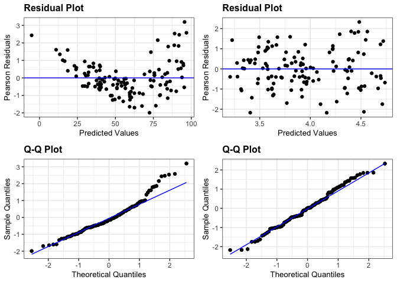
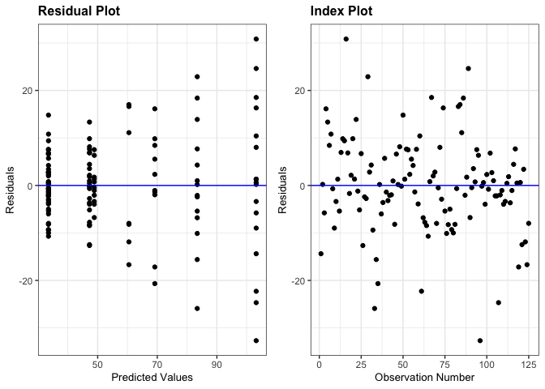

# ggResidpanel 

ggResidpanel is an R package for creating panels of diagnostic plots for
a model using ggplot2 and interactive versions of the plots using
plotly.

## Installation

The code below shows how ggResidpanel can be installed from CRAN. If
desired, the development version of ggResidpanel can be installed from
GitHub.

``` r
# Installs ggResidpanel from CRAN
install.packages("ggResidpanel")

# Installs the development version of ggResidpanel from GitHub
devtools::install_github("goodekat/ggResidpanel")
```

Load the ggResidpanel package.

``` r
# Load the library
library(ggResidpanel)
```

## Learn More

Here are some resources for learning how to use ggResidpanel:

-   [Introduction
    Vignette](https://goodekat.github.io/ggResidpanel/articles/introduction.html)
-   [Tutorial and User
    Manual](https://goodekat.github.io/ggResidpanel-tutorial/tutorial.html)

## Overview and Examples

The package provides five functions that allow the user to assess
diagnostic plots from a model. These functions are:

-   `resid_panel`: Creates a panel of diagnostic plots of the residuals
    from a model
-   `resid_interact`: Creates an interactive panel of diagnostic plots
    of the residuals form a model
-   `resid_xpanel`: Creates a panel of diagnostic plots of the predictor
    variables
-   `resid_compare`: Creates a panel of diagnostic plots from multiple
    models
-   `resid_auxpanel`: Creates a panel of diagnostic plots for model
    types not included in the package

Currently, ggResidpanel allows the first four functions listed above to
work with models fit using the functions of `lm`, `glm`, `lme` (from
nlme), and `lmer` or `glmer` (from lme4 or fit using lmerTest). Each of
these functions is applied below to show the panel that is output from
the function. The functions have multiple input options such as the
formatting options of `scale`, `theme`, `axis.text.size`,
`title.text.size`, and `title.opt`.

The `penguins` data used in the examples below is included in
ggResidpanel.

``` r
str(penguins)
```

    ## 'data.frame':    125 obs. of  4 variables:
    ##  $ heartrate: num  88.8 103.4 97.4 85.3 60.6 ...
    ##  $ depth    : num  5 9 22 25.5 30.5 32.5 38 32 6 10.5 ...
    ##  $ duration : num  1.05 1.18 1.92 3.47 7.08 ...
    ##  $ bird     : Factor w/ 9 levels "1","2","3","4",..: 1 1 1 1 1 1 1 1 1 1 ...

#### `resid_panel`

This function creates a panel of residual diagnostic plots given a
model. It allows the user to select a panel of plots from the options in
the package or create their own panel by selecting from the plots
available for this function.

``` r
# Fit a model
penguin_model <- lme4::lmer(heartrate ~ depth + duration + (1|bird), data = penguins)

# Create the default panel of plots
resid_panel(penguin_model)
```

<!-- -->

``` r
# Create a pancel with residual, qq, and yvp plots, add 95% confidence interval 
# bands to the qq-plot, and change the theme to classic
resid_panel(penguin_model, plots = c("resid", "qq", "yvp"), 
            qqbands = TRUE, theme = "classic")
```

<!-- -->

``` r
# Create a panel with all plots available for a model fit using lmer
resid_panel(penguin_model, plots = "all")
```

<!-- -->

#### `resid_interact`

This function creates interactive versions of residual diagnostic plot
panels given a model. Similar to `resid_panel`, it allows the user to
select a panel of plots from the options in the package or to create
their own panel by selecting from the plots available for this function.

``` r
# Create an interactive panel of the default diagnostic plots
resid_interact(penguin_model)
```



#### `resid_xpanel`

This function creates a panel of plots of the residuals or response
variable versus the predictor (x) variables in the model.

``` r
# Create a panel of plots of the residuals versus the predictor variables
resid_xpanel(penguin_model, jitter.width = 0.1)
```

<!-- -->

``` r
# Create a panel of plots of the response variable versus the predictor variables
resid_xpanel(penguin_model, yvar = "response", jitter.width = 0.1)
```

<!-- -->

#### `resid_compare`

This function creates a panel of residual diagnostic plots given a list
of models. This allows the user to compare the diagnostic plots from
multiple models.

``` r
# Fit the model with a log transformation of the response variable and a 
# quadratic term for duration
penguin_model_log2 <- lme4::lmer(log(heartrate) ~ depth + duration + I(duration^2) + (1|bird), 
                                 data = penguins)

# Plot the residual and normal quantile plots for the two models
resid_compare(list(penguin_model, penguin_model_log2), plots = c("resid", "qq"))
```

<!-- -->

#### `resid_auxpanel`

This function creates a panel of residual diagnostic plots given inputs
of residuals and fitted values to use for models not accepted by
`resid_panel`. Users can select from panel options in the package or
create their own panel from the plots available for this function.

``` r
# Fit a regression tree to the penguins data
penguin_tree <- rpart::rpart(heartrate ~ depth + duration, data = penguins)

# Obtain the predictions from the model on the observed data
penguin_tree_pred <- predict(penguin_tree)

# Obtain the residuals from the model
penguin_tree_resid <- penguins$heartrate - penguin_tree_pred

# Create a panel with the residual and index plot
resid_auxpanel(residuals = penguin_tree_resid, 
               predicted = penguin_tree_pred, 
               plots = c("resid", "index"))
```

<!-- -->
